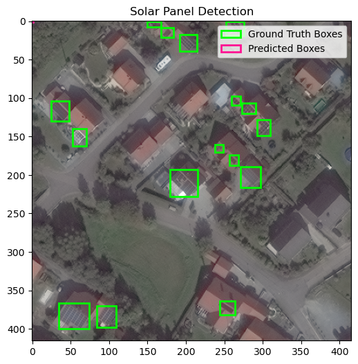
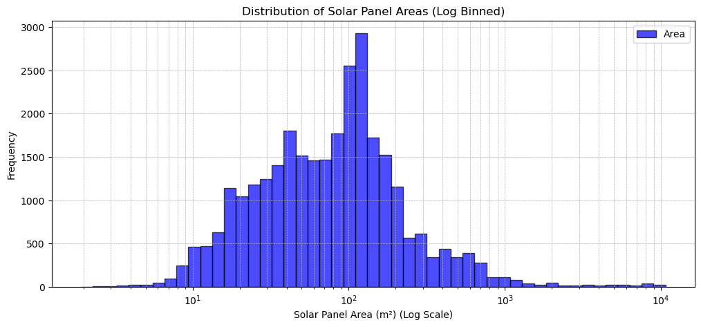
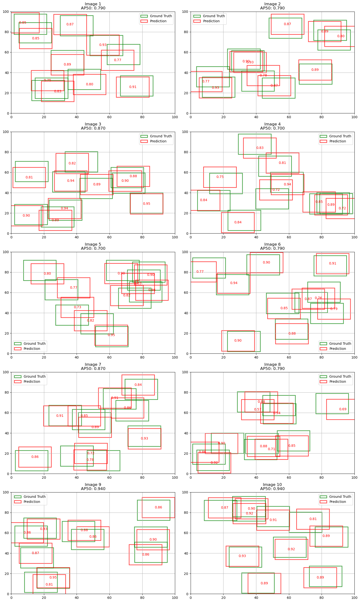

# Solar Panel Detection 

This project implements an object detection system for identifying solar panels in aerial imagery using YOLO (You Only Look Once). The project also includes data exploration, implementation of fundamental object detection metrics, and model training/evaluation.

## Project Structure

```
├── Data Exploration and Understanding.ipynb
├── Functions.py
├── Implementing the Fundamental Functions.ipynb
├── Model building and evaluation.ipynb
├── Ran on Kaggle.ipynb
└── dataset/
    ├── images/
    └── labels/
```

## Dataset Information

- **Resolution**: 31 cm native resolution images (416x416 pixels)
- **Annotation Format**: MS-COCO
- **Annotation Type**: Horizontal Bounding Boxes (HBB)
- **Data Source**: Available on [Google Drive](https://drive.google.com/drive/folders/13QfMQ-7OdWKw-LR8DmypKwSHtI0Hk2wh?usp=sharing) with corresponding labels and documentation
- Sample of the given data shown below

## Implementation Details

### 1. Data Exploration (`Data Exploration and Understanding.ipynb`)

This notebook handles the initial data analysis and understanding:

- Loads and processes image and label data using rasterio
- Computes solar panel instance statistics
- Calculates actual areas of solar panels using:
  - Pixel size (0.31m)
  - Fill factor (0.85)
  - Tilt angle calculation based on latitude given in this [research paper](https://web.stanford.edu/group/efmh/jacobson/Articles/I/TiltAngles.pdf)
- Visualizes area distributions using histogram plots 
### 2. Core Functions (`Functions.py`)

Contains utility functions:

- `iou()`: Computes Intersection over Union using Shapely library
- `AP()`: Implements Average Precision calculation with three methods:
  - Pascal VOC 11-point interpolation
  - COCO 101-point interpolation
  - Area Under Curve (AUC) method
- `eval()`: Evaluates predictions against ground truth
- `plot()`: Visualization function for displaying detection results

### 3. Metric Implementation (`Implementing the Fundamental Functions.ipynb`)

Demonstrates and validates the implementation of fundamental object detection metrics:

- Compares custom IoU implementation with supervision library
- Tests AP calculation methods on randomly generated data shown in the image below 
- Includes visualization of evaluation results
- Provides comparative analysis of different AP calculation methods

### 4. Model Training and Evaluation (`Model building and evaluation.ipynb`)

Handles the complete model pipeline:

- Implements 80-20 train-test split with 10% validation
- Trains YOLO model on the dataset
- Evaluates model performance using multiple metrics:
  - mAP50 (compared between our and supervision implementations)
  - Precision, Recall, and F1-scores at various IoU and confidence thresholds
- Includes visualization of predictions on test samples

### 5. Training Configuration (`Ran on Kaggle.ipynb`)

Contains the training configuration used on Kaggle:

```python
model = YOLO('yolo11s.pt')
results = model.train(
    data='dataset.yaml',
    epochs=70,
    imgsz=416,
    batch=16,
    lr0=0.0002,
    lrf=0.002,
    momentum=0.98,
    weight_decay=0.0001,
    optimizer="RAdam",
    cos_lr=True,
    warmup_epochs=30,
    mosaic=0.0,
    dfl=2.0,
    augment=True
)
```

## Key Features

1. **Area Calculation**: Implements accurate solar panel area calculation considering:
   - Physical pixel size
   - Panel tilt angle based on geographical location
   - Fill factor correction

2. **Metric Implementation**: Custom implementation of:
   - IoU using Shapely library
   - Multiple AP calculation methods
   - Comprehensive evaluation metrics

3. **Visualization**: Includes tools for:
   - Ground truth vs. predictions visualization
   - Performance metric plots
   - Area distribution analysis

4. **Model Evaluation**: Comprehensive evaluation using:
   - Multiple IoU thresholds (0.1, 0.3, 0.5, 0.7, 0.9)
   - Various confidence thresholds (0.1, 0.3, 0.5, 0.7, 0.9)
   - Comparison between custom and library implementations

## Dependencies

- ultralytics
- numpy
- matplotlib
- rasterio
- opencv-python
- pandas
- pyproj
- supervision
- torch
- shapely
- scikit-learn

## Usage

1. Install required dependencies
2. Organize dataset in the specified structure
3. Run notebooks in the following order:
   - Data Exploration and Understanding
   - Implementing the Fundamental Functions
   - Model building and evaluation

## Results

The project successfully implements:
- Custom IoU calculation matching supervision library results
- Three different AP calculation methods
- YOLO model training with comprehensive evaluation
- Detailed performance analysis across multiple metrics

The implementation provides a complete pipeline for solar panel detection from aerial imagery, with both custom and library-based evaluation metrics for comprehensive performance assessment.
